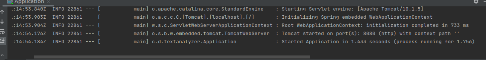

## Text Analyzer

This application analyzes your text input for vowels and consonants

### Components

This application consists of two components, backend written in Java Spring Boot and a frontend component written in Angular

### Running the application locally

* Clone the repo 
* Import the project in your IDE

Backend Component:

1. Run the Application.main()
2. When the application runs successfully, it shows the message in the console, as shown below:

3. Open the browser and invoke the URL http://localhost:8080

Frontend Component

1. In your terminal go to folder /js/text-analyzer-app and run `npm install`
2. Then, run `ng serve`